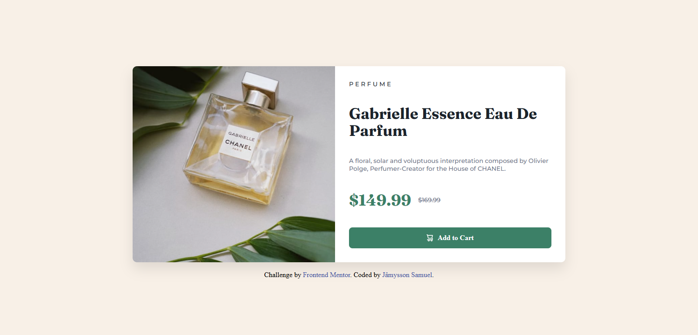
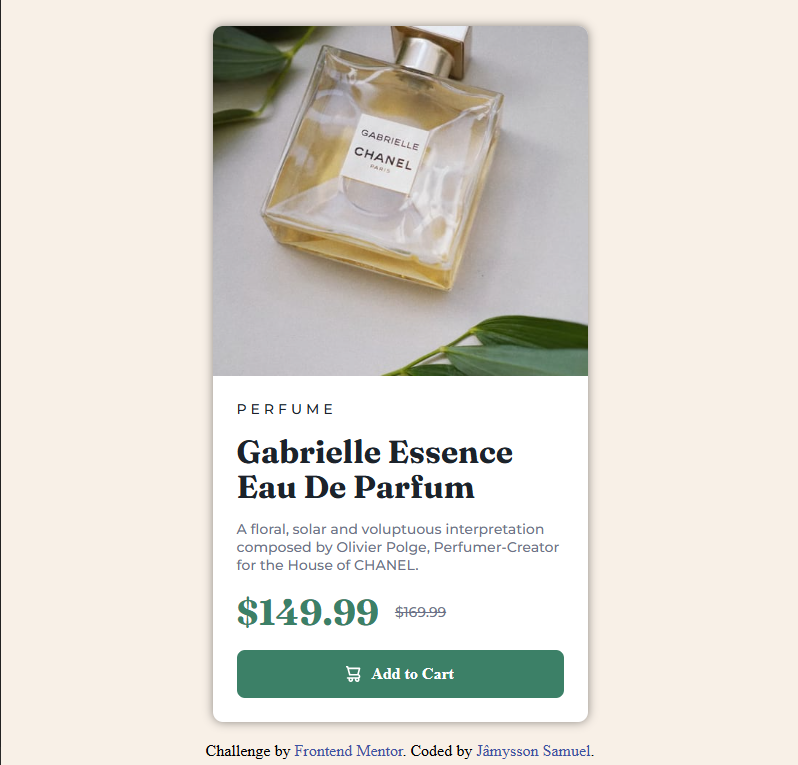

## Sumario

- [Visão Geral](#Visão-Geral)
  - [O Desafio](#o-desafio)
  - [Capturas de tela](#Capturas-de-tela)
  - [Links](#links)
- [Meu Processo](#meu-processo)
  - [Construído com](#Construído-com)
  - [O que aprendi](#O-que-aprendi)
  - [Desenvolvimento contínuo](#Desenvolvimento-contínuo)
  - [Recursos úteis](#Recursos-úteis)
- [Autor](#autor)
- [Agradecimentos](#Agradecimentos)

## Visão Geral

### O desafio

Os usuários devem ser capazes de:

- Visualizar o layout ideal dependendo do tamanho da tela de seu dispositivo
- Ver os estados de :hover (passar o mouse) e :focus (foco) para elementos interativos

### Capturas de tela




### Links

- URL da Solução: (https://github.com/jamyssonsamuel)
- Live Site URL: (https://jamyssonsamuel.github.io/product-preview-card/)

## Meu Processo

### Construído com

- Semantic HTML5 markup
- CSS custom properties
- Flexbox
- Mobile-first workflow
- Media queries
- Google Fonts para tipografia
- Imagens otimizadas (fornecidas pelo desafio)


### O que aprendi

Neste projeto, reforcei e aprofundei meu conhecimento em diversas áreas essenciais do desenvolvimento web front-end:
- Mobile-First Workflow: Foi crucial começar a estilização pensando primeiro no mobile e depois adicionar regras para desktop usando media queries. Isso otimiza o desempenho em dispositivos menores e simplifica a manutenção.
- Layout com Flexbox: O uso de display: flex foi fundamental para centralizar o card na tela, alinhar elementos horizontalmente (como os preços e o conteúdo do botão) e, principalmente, para criar o layout de duas colunas (imagem e detalhes) no desktop.

```css
.product-card {
    display: flex;
}
.img-container, .info {
    flex: 1; 
}
```
- Media Queries para Responsividade: A técnica de usar content: url() em media queries para trocar a imagem de fundo (ou mesmo o src de uma tag ) entre mobile e desktop foi um aprendizado valioso, otimizando a entrega de assets.
```css
@media (min-width: 600px) {
    .img {
        background-image: url('../images/image-product-desktop.jpg'); /* Exemplo para background-image */
    }
    /* Ou para : */
    /* .img img {
        content: url(../images/image-product-desktop.jpg);
    } */
}
```
- Estrutura Semântica HTML: Mantive a preocupação em usar tags HTML com significado (<main>, <footer>, <h1>, <p>, <a>, ) para melhorar a acessibilidade e o SEO.
- Estados Interativos (:hover): Implementar efeitos simples de hover para o botão de compra adiciona um toque profissional à interface do usuário.

### Desenvolvimento contínuo

Pretendo continuar focando em:

- Aprofundar em Flexbox e CSS Grid: Embora Flexbox tenha sido suficiente aqui, quero explorar mais o CSS Grid para layouts mais complexos e entender a melhor forma de combiná-los.
- Acessibilidade (ARIA attributes, Focus Management): Ir além dos estados básicos de :focus e entender como tornar as interfaces mais acessíveis para todos os usuários.
- JavaScript Básico: Começar a adicionar interatividade real aos projetos, como validação de formulários ou sliders simples, que é o próximo passo depois de dominar HTML e CSS.
- Organização de Arquivos e Metodologias CSS: Refinar a forma como organizo meus arquivos CSS (como a divisão style.css e mediaquery.css que usei neste projeto) e explorar metodologias como BEM.

### Recursos úteis

- [Frontend Mentor Documentation](https://www.frontendmentor.io/home) - A documentação do próprio Frontend Mentor é excelente para entender os requisitos e dicas.
- [MDN Web Docs (Mozilla Developer Network)](https://developer.mozilla.org/pt-BR/) - Sempre uma fonte confiável para documentação de HTML, CSS e JavaScript.
- [Flexbox Froggy](https://flexboxfroggy.com/) - Jogo divertido para praticar Flexbox.
- [CSS-Tricks: A Complete Guide to FLexbox](https://css-tricks.com/snippets/css/a-guide-to-flexbox/) - Um guia abrangente sobre Flexbox.

## Autor

- GitHub - [@jamyssonsamuel](https://github.com/jamyssonsamuel)

## Agradecimentos

Gostaria de agradecer ao Frontend Mentor por fornecer este desafio de codificação prático e bem estruturado, que me permitiu aplicar e consolidar meus conhecimentos em HTML e CSS.

